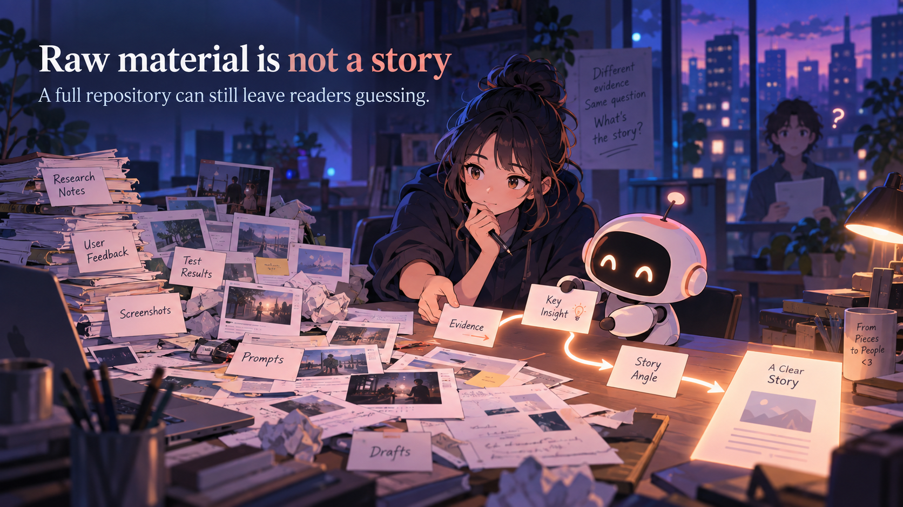

# Content Generation Modules

> **Give every project a clearer story.** A versioned content UX system for turning repository evidence into welcoming, skimmable, reviewable human-facing output.

<p align="center">
  
</p>

**A full repository can still leave readers guessing.** The useful truth may be spread across code, tests, screenshots, research notes, prompts, and unfinished drafts. Content Generation Modules helps an agent or maintainer find the human situation, shape the story, create supporting visuals, and keep every important claim tied to evidence.

A new reader still needs answers the folder tree cannot give: **Who is this for? What problem does it change? What is already real? Which source supports that promise? Where can I begin?** CGM gives a fresh writing session a path through those questions.

If you are trying to make a project understandable, this repository gives you a repeatable starting point:

- **Start with the reader’s problem.**
- **Write the point so it can be skimmed.**
- **Use visuals to explain the work.**
- **Review the story before trusting the polish.**

## Why this exists

**Technical completeness does not automatically create understanding.** A project can have working code, careful tests, and valuable research while its README still makes a new person reverse-engineer what matters.

The failure is familiar: an agent sees a folder tree, produces confident copy, adds a generic hero, and moves on before checking whether the result tells a human why the project exists. The output may be grammatically correct while the product story remains invisible.

The reader is left to connect the dots: a test proves one behavior, a plan describes another, and a polished README can make both sound equally finished. The problem is not solved by a heading alone. The explanation needs a concrete example, a clear consequence, and evidence that shows where the promise stops.

This repository exists to make that work deliberate. It gives the writer a story order, the visual designer a role and review record, the agent a pinned source contract, and the maintainer a clear point at which human judgment still matters.

<p align="center">
  
</p>

## What this project is

Content Generation Modules is a **versioned contract for human-facing brand, content, visual, image, and HTML-demo work**. It helps maintainers, agents, designers, researchers, product people, and engineers turn project evidence into something another person can understand and use.

The target repository owns its product facts, audience, evidence, visual identity, and boundaries. This helper supplies the reusable method: modules, templates, schemas, guides, image records, and deterministic checks.

It does not invent a product story, provide a universal brand, host images, or replace the target repository’s research. **When the evidence is missing, the output should say so.**

## What you can make or use

- **A brand foundation** that names the audience, promise, personality, preferred language, and claim boundaries.
- **A project brief** that maps the user, problem, solution, mechanism, evidence, terminology, and limitations.
- **A story-first README or product document** that earns attention before it introduces architecture.
- **A visual direction** with palette, composition, responsive roles, text policy, and rejection conditions.
- **Generated image briefs and asset records** that explain how to create, review, place, and reuse visuals.
- **An accessible responsive HTML demo** that lets a person inspect the story at desktop, tablet, and mobile widths.

<p align="center">
  
</p>

## How it works

**Every output has one job.** A README explains the project. A hero introduces the promise. A problem image makes the reader’s tension visible. A supporting image explains one mechanism or boundary.

```text
target repository situation and evidence
                    |
                    v
          pinned .content-system adapter
                    |
                    v
brief -> brand -> writing / visual / image / HTML direction
                    |
                    v
        draft -> scan test -> deterministic checks
                    |
                    v
             human review -> useful output
```

1. **Read the repository first.** Find the user, situation, evidence, prior work, and boundaries.
2. **Build the source map.** Record supported claims, status, terminology, and limitations.
3. **Choose the modules.** Load only the brand, context, writing, visual, image, or HTML guidance the requested output needs.
4. **Write for the scan.** Use descriptive headings, short sections, bullets, and selective bold anchors that let a reader recover the point quickly.
5. **Make the visual explain something.** Generate a role-specific asset, inspect it at its actual use size, and record its prompt, alt text, crop, and review decision.
6. **Review before handoff.** Check the evidence, human flow, accessibility, and next action before treating the output as complete.

## Evidence and boundaries

The helper contract is **shipped as repository structure and guidance**: six module entry points, templates, schemas, a validator, image records, README rules, and a version pin. The contract does not prove that a target project’s product claims are true; those claims must come from the target repository.

For each important claim, the new v2 brief makes the explanation explicit: **what does this source support, and what does it leave unproven?** Repository evidence points to an exact revision and useful locator; external claims use direct citations. A citation makes the path inspectable—it does not certify that the source is correct.

The scan-first rules are grounded in usability and accessibility research. Nielsen Norman Group’s study of 51 users found better measured usability when content was concise, scannable, and objective, including descriptive headings, bullets, bold keywords, captions, and shorter sections. The study is useful directional evidence, not a universal conversion promise. The full sources and operational rules are in [`docs/CONTENT_RESEARCH.md`](docs/CONTENT_RESEARCH.md).

**Human review remains authoritative for subjective quality.** Deterministic checks can catch missing sections, files, paths, and version fields. They cannot decide whether a visual feels appropriate, a claim is persuasive, or a story is honest.

## Image generation and use

The README visuals use the repository’s current default brand direction: anime-inspired editorial scenes, a recurring content designer and friendly story-guide companion, deep blue-violet light, warm accents, and one clear workflow per asset.

The [image guide](docs/IMAGE_GUIDE.md) explains how to choose a role, write a prompt, supply exact title and subtitle copy, generate candidates, inspect wide and narrow crops, write alt text, place the asset in Markdown or HTML, and record the final decision. The committed prompt records are in [`assets/marketing/IMAGE_NOTES.md`](assets/marketing/IMAGE_NOTES.md) and [`assets/marketing/asset-manifest.json`](assets/marketing/asset-manifest.json).

For a new target repository, **copy the method, not the characters or scene**. Start from the target’s own visual contract, then keep one dominant idea, one human question, one responsive role, and one review decision per image.

## Templates and guides

Start with the [README template](templates/README.template.md) and its [machine-readable contract](templates/readme-contract.json). The template puts the human situation, promise, usefulness, mechanism, evidence, images, prior work, scan test, and next action in a deliberate order.

- [`docs/CONTENT_RESEARCH.md`](docs/CONTENT_RESEARCH.md) records the UX, accessibility, and marketing research behind scan-first writing.
- [`docs/BRAND_DIRECTION.md`](docs/BRAND_DIRECTION.md) defines the Story Loop brand direction and prior-work visual analysis.
- [`docs/README_PLAYBOOK.md`](docs/README_PLAYBOOK.md) explains the twenty-second test, welcoming language, selective emphasis, evidence status, and human review.
- [`docs/PROVENANCE_AND_CITATION.md`](docs/PROVENANCE_AND_CITATION.md) explains how to connect a claim to an exact source and state its limits.
- [`docs/README_QUALITY_PDD.md`](docs/README_QUALITY_PDD.md), [`docs/README_QUALITY_SDD.md`](docs/README_QUALITY_SDD.md), and [`docs/README_QUALITY_TDD.md`](docs/README_QUALITY_TDD.md) define the reader problem, claim-evidence contract, and acceptance tests.
- [`docs/REVERSE_ANALYSIS_PCM_AND_ADOPTERS.md`](docs/REVERSE_ANALYSIS_PCM_AND_ADOPTERS.md) records what CGM adopts from PCM's explanation and provenance, alongside what Eval Lab and Harness contribute to the story and visuals.
- [`docs/IMAGE_GUIDE.md`](docs/IMAGE_GUIDE.md) explains image roles, prompt structure, exact in-image copy, responsive crops, alt text, manifests, and rejection rules.
- [`docs/HOLDOUT_EVALUATION.md`](docs/HOLDOUT_EVALUATION.md) explains how to test repeatability on private, unseen target repositories.
- [`docs/MIGRATING_TO_0.2.md`](docs/MIGRATING_TO_0.2.md) explains how existing `0.1.x` target repositories adopted the human-facing contract.
- [`docs/MIGRATING_TO_0.3.md`](docs/MIGRATING_TO_0.3.md) explains how existing `0.2.x` target repositories adopt the scan-first and anime-inspired visual direction.
- [`docs/MIGRATING_TO_0.4.md`](docs/MIGRATING_TO_0.4.md) explains how to add bounded claim explanations and revision-pinned citations while preserving the target's image contract.
- [`templates/`](templates/) contains starter project, brand, visual, image, asset, review, and README files.
- [`schemas/`](schemas/) defines both project-brief versions, the asset manifest, review rubric, and README contract shapes.

## Prior work and references

This helper is extracted from repository-specific work. It keeps the story and visual lessons from prior reviewed examples instead of pretending they were invented in this README:

| Repository | What the work contributed |
| --- | --- |
| [Eval Lab](https://github.com/Pukujan/Eval-lab) | Opens with a trust question, then uses problem, system, and evidence visuals to make the research path easy to enter. |
| [Harness on Steroids](https://github.com/Pukujan/harness-on-steroids) | Uses a human and friendly companion to make a research-act-verify loop feel concrete and memorable. |
| [Custom Extensions](https://github.com/Pukujan/custom-extensions) | Shows how to explain an everyday problem before installation, permissions, risk, and implementation. |
| [Hades Product](https://github.com/Pukujan/hades-product) | Keeps privacy, continuity, and product boundaries legible in a human relationship story. |
| [Peeps case study](https://www.linamakesnoise.com/peeps) | Demonstrates audience-led personality, onboarding, user flow, motion, and a visual metaphor that supports the product story. |

The cross-repository adoption record is [Project Continuity Modules task PCM-0008](https://github.com/Pukujan/project-continuity-modules/blob/main/tasks/TASK-PCM-0008-multi-repo-content-system.md).

The detailed evidence map is [`docs/PRIOR_WORK.md`](docs/PRIOR_WORK.md).

## Try it

**The smallest useful path is one target adapter and one reviewed README.** From this repository root:

```powershell
python scripts/validate_content_system.py --root .
python -m unittest discover -s tests -v
```

For a target project, add this adapter:

```text
.content-system/
├── system-version.json
├── project-brief.json
├── brand-language.json
├── visual-style.json
├── asset-manifest.json
└── review-rubric.json
```

Start the target adapter from [`templates/system-version.json`](templates/system-version.json); do not copy this helper repository's root `system-version.json` into a target. Pin the helper release and full commit there, read the playbook and image guide, inspect prior reviewed outputs, fill the v2 claim records from repository evidence, write what each source supports and leaves unproven, add direct citations, run the validator against the actual README and adapter, and complete the twenty-second scan test. A new ChatGPT session should be able to follow these steps from the target repo and pinned helper without relying on earlier chat.

## Current version

The current helper contract is `0.4.2` (`v0.4.2`). It keeps versioned claim evidence, citation and provenance guidance, and the PCM-informed reader story. New target briefs record a complete source-mapped boundary inventory, repeat every boundary verbatim in the generated README, and select a small set of evidence-backed `must_preserve` entries from that inventory. Visible citations use concise descriptive link text while their destinations retain the full source revision. The story order, brand, generated visuals, narrative-raster rules, prompt records, and image review requirements continue unchanged. Existing target repositories remain on their pinned contract until they deliberately migrate.
