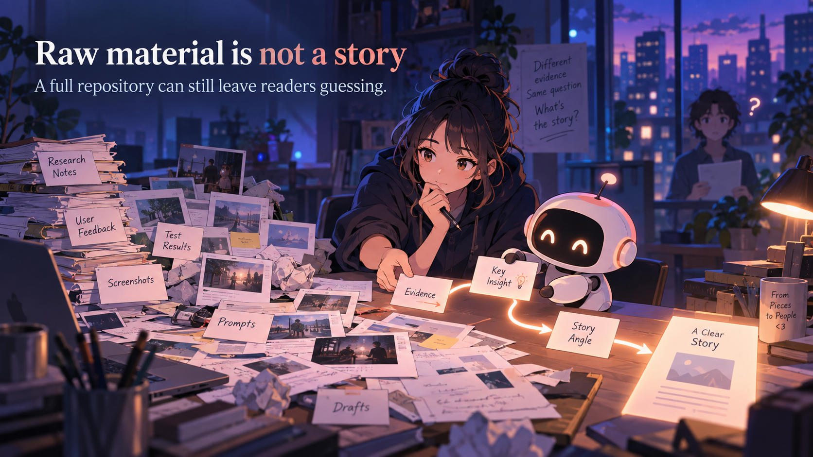

# Content Generation Modules

> **Give every project a clearer story.** A versioned content UX system for turning repository evidence into welcoming, skimmable, reviewable human-facing output.

**Current helper version: `0.5.8` (`v0.5.8`).** Pin this version or a commit SHA in adapters and ACS hotload — never silently follow moving `main`. Every adopter must inject the always-on HSW system block from `docs/writing-routing.json` (`acs_prompt_inject.system_block`) at agent start, then confirm with `python scripts/verify_hsw_applied.py --root <cgm>` (optional `--html <compare.html>` before publishing human-facing HTML). Adopter content freshness and asset references are verified via `python scripts/verify_adopter_content.py` or `validate_content_system.py --check-adopter-docs`. Operational failures (pin ≠ enforcement) follow [`docs/ISSUE_LOG.md`](docs/ISSUE_LOG.md) / [`docs/issue-log-contract.json`](docs/issue-log-contract.json).

<p align="center">
  
</p>

**A full repository can still leave readers guessing.** Useful truth is often scattered across code, tests, screenshots, research notes, and unfinished drafts. Content Generation Modules (CGM) gives an agent or maintainer a repeatable path: find the human situation, shape the story, create supporting visuals, and keep every important claim tied to evidence.

A new reader still needs answers the folder tree cannot give: **Who is this for? What problem does it change? What is already real? Which source supports that promise? Where can I begin?**

## Module catalog

Load only the modules the requested output needs. Paths are relative to this helper root. Canonical **module id** = folder name under `modules/`.

| Module id | Path | Job | When to load |
| --- | --- | --- | --- |
| `brand-foundation` | [`modules/brand-foundation`](modules/brand-foundation) | Audience, promise, personality, language boundaries, claim limits | Before public copy or visuals |
| `content-context` | [`modules/content-context`](modules/content-context) | Evidence-bounded project brief from the target repo | Entering a repo or when the product story changed |
| `writing-direction` | [`modules/writing-direction`](modules/writing-direction) | Scan-first README / product-entry story and selective bold | **MUST load** for README or product entry pages |
| `human-sounding-writing` | [`modules/human-sounding-writing`](modules/human-sounding-writing) | Human voice, AI-tell scrub, restrained bold (short name **hsw** / HSW) | **MUST load (default ON)** for every human-facing deliverable except README/product entry: PRs, issues, commits, docs, posts, papers, **HTML reports / compare HTML / compare UIs** |
| `human-output-naming` | [`modules/human-output-naming`](modules/human-output-naming) | Speakable generated artifact / asset filenames + per-feature legends (short name **hon** / HON) | **MUST load** before naming generated media, asset-manifest paths, committed media basenames, or filename legends |
| `visual-direction` | [`modules/visual-direction`](modules/visual-direction) | Palette, composition, responsive roles, rejection rules | Before generating or placing visuals |
| `image-generation` | [`modules/image-generation`](modules/image-generation) | Reproducible image briefs, prompts, and asset records | Creating or reviewing narrative raster assets |
| `html-demo` | [`modules/html-demo`](modules/html-demo) | Accessible responsive HTML demo of the story | Demo pages that must hold up at mobile / tablet / desktop |

**Load id for hsw remains `human-sounding-writing`.** Agents asked for "hsw" or "HSW" load that module; do not invent a separate folder or adapter id.

**Load id for hon remains `human-output-naming`.** Agents asked for "hon" or "HON" load that module; call `scripts/human_filename.build_basename` (speakable by default; optional `style="safe_twin"`) and keep a per-feature filename legend.

## Writing router

Soft router — soft means no NLP CI grade of prose, **not** optional load. Agents **MUST load** the routed module (`required_load`). **HSW is default ON** for every human-facing deliverable except README/product entry (and filename-only → **hon**). No per-report opt-in.

| Situation | Load | Notes |
| --- | --- | --- |
| README / product entry | `writing-direction` (+ brand / context as needed) | **MUST load.** Keep scan-first selective bold |
| PR titles/bodies, issue titles/bodies, issue-log titles | `human-sounding-writing` (**hsw**) | **MUST load.** Human-facing GitHub prose |
| Commit messages / commit subjects | `human-sounding-writing` (**hsw**) | **MUST load.** Plain human subject; in scope as of 0.5.3 |
| Non-README docs, changelog prose | `human-sounding-writing` (**hsw**) | **MUST load.** Guides and narrative changelog text |
| Posts / blogs / social / general prose | `human-sounding-writing` (**hsw**) | **MUST load.** Human voice; restrained bold |
| Papers / data writeups | `human-sounding-writing` (**hsw**) | **MUST load.** Same voice; apply chart / takeaway guidance |
| HTML reports / compare HTML / compare UIs / appendable HTML | `human-sounding-writing` (**hsw**) | **MUST load (default ON as of 0.5.7).** Visible prose in human-facing HTML; no per-report opt-in |
| Generated artifact filenames / asset-manifest paths / committed media / filename legends | `human-output-naming` (**hon**) | **MUST load.** Speakable basenames (omit defaults) via `scripts/human_filename`; optional safe twin; per-feature legend; never opaque `p0`/hex or robot key=value stems |

Full table, apply checklist, and conflict notes: [`docs/WRITING_ROUTING.md`](docs/WRITING_ROUTING.md) · machine-readable [`docs/writing-routing.json`](docs/writing-routing.json) (`required_load`, `human_facing_default`, `acs_prompt_inject`). Guide + rules: [`docs/HUMAN_SOUNDING_WRITING.md`](docs/HUMAN_SOUNDING_WRITING.md), [`docs/human-sounding-rules.json`](docs/human-sounding-rules.json). Filename contract: [`docs/HUMAN_OUTPUT_NAMING.md`](docs/HUMAN_OUTPUT_NAMING.md), [`docs/human-output-naming.json`](docs/human-output-naming.json). ACS verify + inject: [`docs/ACS_VERIFY.md`](docs/ACS_VERIFY.md).

**Filename before/after (0.5.5+):** `song_food-p0-00e86d.mp3` (and rejected robot draft `song-food_pitch-plus-8st_speed-0pct.mp3`) → `Song Food – up 8.mp3`. Defaults omitted; optional safe twin `song-food--up-8.mp3`. Per-feature legends live under [`docs/filename-legends/`](docs/filename-legends/). Hash stays an asset field (or suffix after human labels), never the basename.

**This README uses writing-direction** (scan-first selective bold). Do not apply hsw bold restraints to README or product-entry copy.

## Why this exists

**Technical completeness does not automatically create understanding.** A project can have working code, careful tests, and valuable research while its README still makes a new person reverse-engineer what matters.

The failure is familiar: an agent sees a folder tree, produces confident copy, adds a generic hero, and moves on before checking whether the result tells a human why the project exists. The output may be grammatically correct while the product story remains invisible.

This repository exists to make that work deliberate. It gives the writer a story order, the visual designer a role and review record, the agent a pinned source contract, and the maintainer a clear point at which human judgment still matters.

<p align="center">
  
</p>

## What this project is

Content Generation Modules is a **versioned contract for human-facing brand, content, visual, image, and HTML-demo work**. Maintainers, agents, designers, researchers, product people, and engineers use it to turn project evidence into something another person can understand and use.

The target repository owns its product facts, audience, evidence, visual identity, and boundaries. This helper supplies the reusable method: modules, templates, schemas, guides, image records, and deterministic checks.

It does not invent a product story, provide a universal brand, host images, or replace the target repository’s research. **When the evidence is missing, the output should say so.**

## What you can make or use

- **A brand foundation** that names the audience, promise, personality, preferred language, and claim boundaries.
- **A project brief** that maps the user, problem, solution, mechanism, evidence, terminology, and limitations.
- **A story-first README or product document** that earns attention before it introduces architecture.
- **Human-sounding posts, blogs, social copy, and papers** via `human-sounding-writing` / **hsw**.
- **A visual direction** with palette, composition, responsive roles, text policy, and rejection conditions.
- **Generated image briefs and asset records** that explain how to create, review, place, and reuse visuals.
- **An accessible responsive HTML demo** that lets a person inspect the story at desktop, tablet, and mobile widths.

<p align="center">
  
</p>

## How it works

**Every output has one job.** A README explains the project. A hero introduces the promise. A problem image makes the reader’s tension visible. A supporting image explains one mechanism or boundary.

```text
target repository situation and evidence
                    |
                    v
          pinned .content-system adapter
                    |
                    v
brief -> brand -> writing / visual / image / HTML direction
                    |
                    v
        draft -> scan test -> deterministic checks
                    |
                    v
             human review -> useful output
```

1. **Read the repository first.** Find the user, situation, evidence, prior work, and boundaries.
2. **Build the source map.** Record supported claims, status, terminology, and limitations.
3. **Choose the modules.** Use the [module catalog](#module-catalog) and [`docs/WRITING_ROUTING.md`](docs/WRITING_ROUTING.md).
4. **Write for the scan** (README) or human voice (posts / papers). Do not merge those bold policies.
5. **Make the visual explain something.** Generate a role-specific asset, inspect it at use size, and record prompt, alt text, crop, and review decision.
6. **Review before handoff.** Check evidence, human flow, accessibility, and next action.

## Pin this helper for adapters and ACS

Target repos and ACS multi-agent-hotload must **pin a helper version or commit SHA**. List the module ids you need in the adapter. Do not silently follow moving `main`.

Adapter layout in the target repository:

```text
.content-system/
├── system-version.json
├── project-brief.json
├── brand-language.json
├── visual-style.json
├── asset-manifest.json
└── review-rubric.json
```

In `system-version.json` (or your ACS pin config):

- set helper `version` to **`0.5.8`** (or pin an exact commit SHA of this repo);
- list module ids from the catalog (for writing: usually `writing-direction` and/or `human-sounding-writing`);
- point agents at this README and the `modules/<id>/SKILL.md` files under the pinned tree.

Validate from the helper root or target adapter root:

```bash
# Full CGM helper contract
python scripts/validate_content_system.py --root .

# ACS hotload writing gate (HSW + writing-direction + soft router)
python scripts/validate_content_system.py --root . --mode writing

# Helper + adopter adapter
python scripts/validate_content_system.py --root . --adapter ../adopter/.content-system --project-root ../adopter

# Helper + adopter adapter + content freshness / asset reference enforcement
python scripts/validate_content_system.py --root . --adapter ../adopter/.content-system --project-root ../adopter --check-adopter-docs

# Standalone adopter content freshness & asset reference check
python scripts/verify_adopter_content.py --adapter ../adopter/.content-system --project-root ../adopter

python -m unittest discover -s tests -v
```

ACS / multi-agent-hotload should call `--mode writing` (and prefer full helper or helper+adapter for install completeness). Details: [`docs/ACS_VERIFY.md`](docs/ACS_VERIFY.md).

Migration notes for adding `human-sounding-writing` / hsw and `human-output-naming` / hon: [`docs/MIGRATING_TO_0.5.md`](docs/MIGRATING_TO_0.5.md).

## Evidence and boundaries

The helper contract is **shipped as repository structure and guidance**: eight module entry points, templates, schemas, a validator, image records, README rules, and a version pin. The contract does not prove that a target project’s product claims are true; those claims must come from the target repository.

For each important claim, the v2 brief makes the explanation explicit: **what does this source support, and what does it leave unproven?** Repository evidence points to an exact revision and useful locator; external claims use direct citations. A citation makes the path inspectable—it does not certify that the source is correct.

The scan-first rules are grounded in usability and accessibility research. Nielsen Norman Group’s study of 51 users found better measured usability when content was concise, scannable, and objective, including descriptive headings, bullets, bold keywords, captions, and shorter sections. The study is useful directional evidence, not a universal conversion promise. Full sources: [`docs/CONTENT_RESEARCH.md`](docs/CONTENT_RESEARCH.md).

**Human review remains authoritative for subjective quality.** Deterministic checks catch missing sections, files, paths, and version fields. They cannot decide whether a visual feels appropriate, a claim is persuasive, or a story is honest.

## Image generation and use

The README visuals use the repository’s current default brand direction: anime-inspired editorial scenes, a recurring content designer and friendly story-guide companion, deep blue-violet light, warm accents, and one clear workflow per asset.

The [image guide](docs/IMAGE_GUIDE.md) explains how to choose a role, write a prompt, supply exact title and subtitle copy, generate candidates, inspect wide and narrow crops, write alt text, place the asset in Markdown or HTML, and record the final decision. Committed prompt records: [`assets/marketing/IMAGE_NOTES.md`](assets/marketing/IMAGE_NOTES.md) and [`assets/marketing/asset-manifest.json`](assets/marketing/asset-manifest.json).

For a new target repository, **copy the method, not the characters or scene**. Start from the target’s own visual contract, then keep one dominant idea, one human question, one responsive role, and one review decision per image.

## Templates and guides

> **Helper README note:** This section documents CGM itself. Adopter / target READMEs (0.5.4+) must stay product-only and must not copy this section, cite CGM, or narrate image-gen / writing methodology — see `adopter_readme_policy` in [`templates/readme-contract.json`](templates/readme-contract.json).

Start with the [README template](templates/README.template.md) and its [machine-readable contract](templates/readme-contract.json). The template puts the human situation, promise, usefulness, mechanism, evidence, images, prior work, scan test, and next action in a deliberate order.

- [`docs/CONTENT_RESEARCH.md`](docs/CONTENT_RESEARCH.md) — UX, accessibility, and marketing research behind scan-first writing.
- [`docs/BRAND_DIRECTION.md`](docs/BRAND_DIRECTION.md) — Story Loop brand direction and prior-work visual analysis.
- [`docs/README_PLAYBOOK.md`](docs/README_PLAYBOOK.md) — twenty-second test, welcoming language, selective emphasis, evidence status, human review.
- [`docs/PROVENANCE_AND_CITATION.md`](docs/PROVENANCE_AND_CITATION.md) — claim → exact source, with limits.
- [`docs/README_QUALITY_PDD.md`](docs/README_QUALITY_PDD.md), [`docs/README_QUALITY_SDD.md`](docs/README_QUALITY_SDD.md), [`docs/README_QUALITY_TDD.md`](docs/README_QUALITY_TDD.md) — reader problem, claim-evidence contract, acceptance tests.
- [`docs/REVERSE_ANALYSIS_PCM_AND_ADOPTERS.md`](docs/REVERSE_ANALYSIS_PCM_AND_ADOPTERS.md) — what CGM adopts from PCM, Eval Lab, and Harness.
- [`docs/IMAGE_GUIDE.md`](docs/IMAGE_GUIDE.md) — image roles, prompts, crops, alt text, manifests, rejection rules.
- [`docs/HOLDOUT_EVALUATION.md`](docs/HOLDOUT_EVALUATION.md) — repeatability on private, unseen target repositories.
- [`docs/MIGRATING_TO_0.2.md`](docs/MIGRATING_TO_0.2.md) · [`docs/MIGRATING_TO_0.3.md`](docs/MIGRATING_TO_0.3.md) · [`docs/MIGRATING_TO_0.4.md`](docs/MIGRATING_TO_0.4.md) · [`docs/MIGRATING_TO_0.5.md`](docs/MIGRATING_TO_0.5.md) — adapter migration paths.
- [`docs/WRITING_ROUTING.md`](docs/WRITING_ROUTING.md) · [`docs/writing-routing.json`](docs/writing-routing.json) · [`docs/ACS_VERIFY.md`](docs/ACS_VERIFY.md) · [`docs/HUMAN_SOUNDING_WRITING.md`](docs/HUMAN_SOUNDING_WRITING.md) — writing router, ACS verify entrypoint, and hsw guide.
- [`templates/`](templates/) · [`schemas/`](schemas/) — starter files and contract shapes.

## Prior work and references

This helper is extracted from repository-specific work. It keeps the story and visual lessons from prior reviewed examples instead of pretending they were invented here:

| Repository | What the work contributed |
| --- | --- |
| [Eval Lab](https://github.com/Pukujan/Eval-lab) | Opens with a trust question, then uses problem, system, and evidence visuals to make the research path easy to enter. |
| [Harness on Steroids](https://github.com/Pukujan/harness-on-steroids) | Uses a human and friendly companion to make a research-act-verify loop feel concrete and memorable. |
| [Custom Extensions](https://github.com/Pukujan/custom-extensions) | Shows how to explain an everyday problem before installation, permissions, risk, and implementation. |
| [Hades Product](https://github.com/Pukujan/hades-product) | Keeps privacy, continuity, and product boundaries legible in a human relationship story. |
| [Peeps case study](https://www.linamakesnoise.com/peeps) | Demonstrates audience-led personality, onboarding, user flow, motion, and a visual metaphor that supports the product story. |

The cross-repository adoption record is [Project Continuity Modules task PCM-0008](https://github.com/Pukujan/project-continuity-modules/blob/main/tasks/TASK-PCM-0008-multi-repo-content-system.md). Detailed evidence map: [`docs/PRIOR_WORK.md`](docs/PRIOR_WORK.md).

## Try it

**The smallest useful path is one target adapter and one reviewed README.**

1. Pin helper **`0.5.8`** (or a commit SHA) — see [Pin this helper](#pin-this-helper-for-adapters-and-acs).
2. Add the `.content-system/` adapter files in the target repo.
3. Load modules from the [catalog](#module-catalog); for writing, follow the [router](#writing-router).
4. Fill v2 claim records from repository evidence; run the scan test; run the validator.
5. Complete human review before treating the output as complete.

A new agent session should follow these steps from the target repo and pinned helper without relying on earlier chat.
